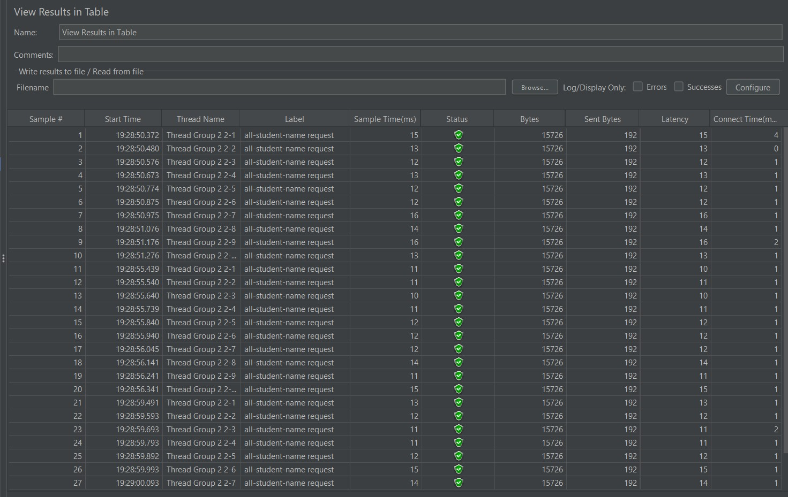
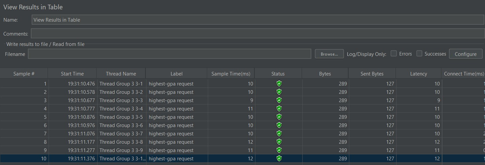
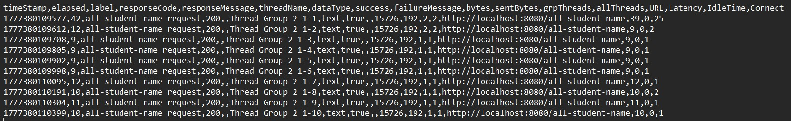
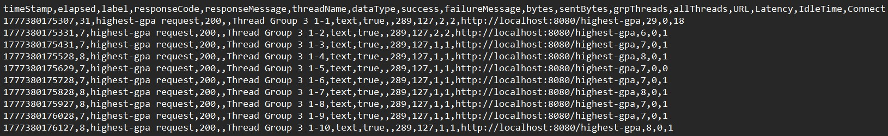
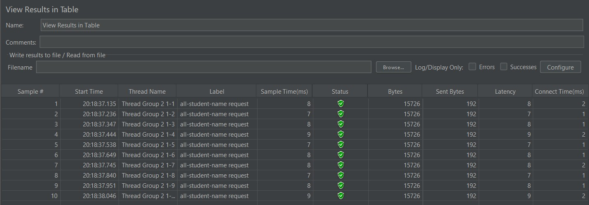
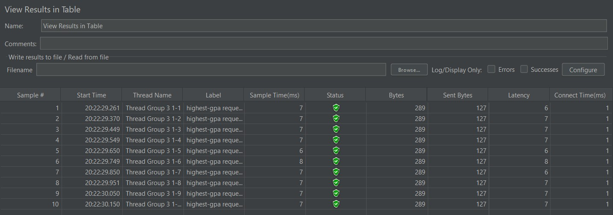

## Modul 7 - Profiling

### Performance Testing
1. Screenshot performance testing /all-student-name

2. Screenshot performance testing /highest-gpa

3. Screenshot performance testing /all-student-name via Terminal

4. Screenshot performance testing /highest-gpa via Terminal

### Profiling and Performace Optimization
Screenshot perfomance testing /all-student-name setelah optimasi

Screenshot performance testing /highest-gpa setelah optimasi

Berdasarkan kedua gambar tersebut, apabila kita bandingkan keduanya dengan screenshot masing-masing performance testing sebelum optimasi, kita bisa melihat bahwa rata-rata sample time dalam ms dari setelah optimasi lebih cepat daripada sebelum optimasi. Peningkatan rata-rata kecepatan sample time juga melebihi 20%. Kesimpulannya, optimasi yang dilakukan berhasil dan berdampak signifikan.

### Reflection
1. Perfomance testing dengan JMeter mensimulasikan traffic pengguna nyata dengan mengirimkan banyak request HTTP secara bersamaan. Metrik yang diukur adalah metrik keseluruhan seperti rata-rata response time, throughput, dan tingkat error aplikasi pada load yang tinggi. Sifat dari testing ini adalah testing eksternal. Sedangkan profiling menggunakan IntelliJ Profiler adalah testing internal karena Profiler terhubung langsung dengan Java Virtual Machine (JVM). Kita bisa memantau apa yang sebenarnya terjadi saat run aplikasi tersebut.

2. Proses profiling memberikan representasi visual dari eksekusi aplikasi seperti Flame Graph dan Call Tree. Ini sangat membantu mengidentifikasi titik lemah dengan meng-highlight method yang paling banyak memakan waktu CPU atau membuat terlalu banyak objek di memori (heap). Contohnya pada aplikasi ini, Profiler dengan mengekspos masalah N+1 query dengan menunjukkan ribuan pemanggilan database yang dieksekusi di dalam sebuah perulangan (loop). Visualisasi ini menghindari kita dari menebak letak kesalahan kode dan langsung mengarahkan kita ke baris kode yang perlu diperbaiki.

3. Ya. Integrasi IntelliJ Profiler dengan IDE adalah keuntungan terbesarnya. Ketika kita melihat sebuah bottleneck di Flame Graph—misalnya ada blok waktu eksekusi yang sangat besar hanya untuk `studentRepository.findAll()` kita bisa langsung mengkliknya dan berpindah ke baris kode sumber yang bermasalah tersebut. IntelliJ Profiler juga mengubah metrik JVM yang sulit dipahami menjadi data visual yang mudah dibaca dan bisa langsung ditindaklanjuti.

4. Tantangan utamanya adalah membedakan antara masalah yang murni disebabkan oleh logika kode aplikasi dengan masalah akibat faktor lingkungan seperti koneksi database yang lambat, RAM laptop yang terbatas, atau background task dari OS yang sedang berjalan. Tantangan lainnya adalah memastikan data tesnya realistis. Jika data di database terlalu sedikit, bottleneck akan kurang terlihat. Untuk mengatasinya, saya memastikan ada cukup banyak data yang di-seed ke dalam database sebelum melakukan pengujian (disini saya men-seed 1000 data student dan 6 course). Saat membaca profiler, saya juga fokus menganalisis blok dengan persentase terbesar di Flame Graph terlebih dahulu untuk mengisolasi bottleneck utama seperti query database daripada proses internal JVM lain yang berdampak kecil.

5. - Bisa menunjuk langsung method mana yang menggunakan CPU atau memori yang besar
   - Tidak perlu melakukan logging secara manual atau menebak-nebak penyebab lambatnya aplikasi sehingga menghemat waktu
   - Dapat menemukan memory leak tersembunyi atau objek sampah yang tidak efisien seperti operasi `result += string` di dalam loop.
   - Bisa melihat secara pasti jumlah query SQL yang di-generate dan dikirimkan oleh Spring Data JPA dibalik layar.

6. Ketidakkonsistenan biasanya berarti bottleneck-nya berada di luar eksekusi kode Java itu sendiri. Jika JMeter menunjukkan response time yang sangat lambat tetapi IntelliJ Profiler menunjukkan bahwa eksekusi kode Java-nya sangat cepat, penyebab lambatnya kemungkinan besar ada di tempat lain. Misalnya: latensi jaringan, waktu eksekusi query di sisi database (PostgreSQL) yang lambat, atau thread pool server yang habis (Tomcat harus menunggu thread kosong). Untuk menangani hal tersebut, saya bisa memperluas cakupan pengecekan seperti mengecek kecepatan eksekusi query langsung di database management tool, mengecek konfigurasi connection pool (HikariCP), atau memantau penggunaan resource OS secara keseluruhan.

7. - Strategi optimasi: Saya mendelegasikan pemrosesan data yang berat ke database sebisa mungkin, misalnya dengan menggunakan query `ORDER BY ... LIMIT 1` daripada mengambil semua data lalu melakukan pencarian nilai maksimum di memori Java. Saya menyelesaikan masalah N+1 query dengan memanfaatkan operasi `JOIN FETCH` atau memastikan pencarian dilakukan dalam satu query besar. Saya juga mengoptimalkan penggunaan memori dengan mengganti manipulasi tipe data immutable (`String`) di dalam loop menggunakan `StringBuilder` atau Java Streams.
   - Memastikan fungsionalitas: Sebelum dan sesudah melakukan perubahan kode tersebut, saya melakukan pengujian otomatis seperti unit tests. Jika file `TutorialApplicationTests.java` dan test endpoint lainnya tetap sukses (passed) setelah saya mengubah logika internal kode, saya bisa yakin bahwa fungsionalitas eksternal dan output data yang diterima pengguna tidak berubah atau rusak.